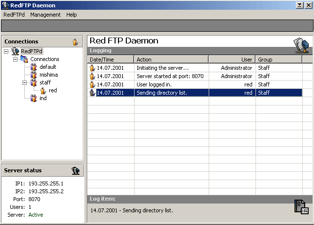



## RedFTP Daemon \- A Windows FTP Server

### Description

It is what it says, a FTP Server. Based on the

source of nearly all the others here, gathered

what was useful into this one. Also got support

for SITE commands that some of you might be

aware of from glFTPd for Linux. As well as a

bit script support have been added. The user

and group system are also nearly done, just

needs a bit more works.

IMPORTANT: You need to read the IMPORTANT.TXT

file that is included within the .rar file

of this package.
 
### More Info
 
IMPORTANT NOTE! Read the Important.txt file

included within the .rar file that is shipped

with this .zip file. That file explains where

to get and install the necessary .OCX files if

you don't already have them installed.

             |
---                |---
**Submitted On**   |2001-07-14 02:33:42
**By**             |[Red](https://github.com/Planet-Source-Code/PSCIndex/blob/master/ByAuthor/red.md)
**Level**          |Intermediate
**User Rating**    |5.0 (25 globes from 5 users)
**Compatibility**  |VB 5\.0, VB 6\.0
**Category**       |[Complete Applications](https://github.com/Planet-Source-Code/PSCIndex/blob/master/ByCategory/complete-applications__1-27.md)
**World**          |[Visual Basic](https://github.com/Planet-Source-Code/PSCIndex/blob/master/ByWorld/visual-basic.md)
**Archive File**   |[RedFTP Dae227397132001\.zip](https://github.com/Planet-Source-Code/red-redftp-daemon-a-windows-ftp-server__1-25001/archive/master.zip)

